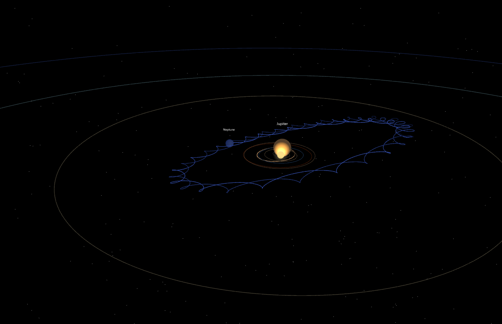

# Solar System — Real Newtonian Dynamics

**→ Live demo: [foxontheerun.github.io/kam-solar-system](https://foxontheerun.github.io/kam-solar-system/)**

Interactive 3D simulation of the Solar System with real planetary masses, distances, and Newtonian gravity. The KAM-stability panel lets you break stability by scaling masses, eccentricities, and orbital inclinations, or by applying gas drag.

Built with [three.js](https://threejs.org/), no build step required.



*After applying «break KAM»: with all planet masses scaled ×800, Jupiter (now ≈ 0.76 M⊙) becomes a star, forming a tight binary with the Sun. Inner planets are absorbed; Neptune is left on a circumbinary orbit, tracing the characteristic epicyclic loops first studied by Euler in the 18th century and observed in modern exoplanet systems like Kepler-16b.*

## What you can do

- Watch the real Solar System under Newtonian gravity at speeds from 1 to 1000 years per second.
- See Mercury's perihelion precession from planetary perturbations — about 532″/century is the part an N-body integrator can in principle reproduce at long times (the 43″/century relativistic excess is not modelled; the demo doesn't measure the precession rate explicitly).
- Switch to the inertial frame and see the Sun wobble around the system's centre of mass (the basis of the radial-velocity exoplanet-detection method).
- Break stability through any of four mechanisms: planet masses, orbital eccentricities, inclinations, or gas drag.
- Apply KAM presets that demonstrate specific dynamical regimes: golden-ratio resonance protection, integer resonances (2:1, 3:1) at Kirkwood-gap positions, and full catastrophic collapse.

## Files

```
solar-system/
├── index.html          page structure, importmap for three.js, UI panels
├── styles/
│   ├── tokens.css      CSS custom properties (colours) — edit to retheme
│   └── main.css        HUD, sliders, sections, mobile media queries
├── main.js             scene assembly and orchestration
├── README.md
├── PHYSICS.md
├── LICENSE             MIT
├── .gitignore
├── vendor/three/       pinned three.js@0.160.0 (vendored — no CDN dependency)
├── screenshots/        preview images
└── src/
    ├── data.js                 planet data, KAM presets, camera presets
    ├── theme.js                planet and Sun colour palette
    ├── orbital-mechanics.js    Kepler ↔ Cartesian, instantaneous eccentricity
    ├── physics-engine.js       N-body Velocity-Verlet integration with drag
    ├── scene-builder.js        scene, lights, mesh factories, barycenter marker
    ├── asteroid-belt.js        decorative particle field with custom shader
    ├── ui-controller.js        DOM bindings, slider handlers, KAM logic
    └── animation-loop.js       requestAnimationFrame, HUD updates
```

## Tests

Unit tests for the pure-math modules and integration tests for energy / angular-momentum / centre-of-mass conservation.

```bash
npm install   # one-time: installs vitest and three for testing
npm test
```

Runtime stays no-build — the npm dependencies are dev-only and live in `node_modules/` (gitignored). The page itself loads three.js from the vendored `vendor/three/`.

## Physics and numerical methods

See [PHYSICS.md](PHYSICS.md) for detailed documentation of units, the Velocity-Verlet integrator, force calculations (Newtonian gravity + linear gas drag), coordinate frames, derived quantities (Laplace–Runge–Lenz eccentricity, Kepler period), KAM preset rationale, asteroid-belt simplifications, and references.

## Run locally

ES modules require a local HTTP server — opening `index.html` directly via double-click will fail with CORS errors.

```bash
cd solar-system
python -m http.server 8000
# then open http://localhost:8000 in browser
```

Or any other static server (Node `http-server`, VS Code Live Server extension, etc.).

## Deploy to GitHub Pages

If you fork this repository and want to publish your own copy:

1. Push the contents to the root of a public GitHub repository.
2. Open **Settings → Pages**, set Source to **Deploy from a branch**, Branch to **main**, folder to **/ (root)**, and Save.
3. After ~1 minute the site will be live at `https://<your-username>.github.io/<repo-name>/`.

## Embedding on another site

```html
<iframe src="https://<your-username>.github.io/<repo-name>/"
        width="100%" height="700"
        style="border: none; border-radius: 12px;">
</iframe>
```

## Observable phenomena

The simulation reproduces several real celestial-mechanical effects, in order of how visible they are:

1. **Perihelion precession of Mercury** — about 532″/century from gravitational perturbations by the other planets is what an N-body integrator is expected to reproduce at long times (the demo doesn't measure it explicitly). The famous additional 43″/century that Einstein explained via General Relativity is not modelled here; the often-quoted total of ~5600″/century includes the precession of the equinox itself, which is a choice-of-frame effect rather than an orbital one. Visible at speeds above 100 years/s as the orbit plane slowly turning.
2. **Sun wobble around the barycenter** in the inertial frame. The barycenter of the Sun-Jupiter pair lies 1.07 solar radii outside the Sun's surface in reality. Use the visual-scale slider to shrink the Sun and verify this geometrically.
3. **Precession of ascending nodes**, eccentricity oscillations (Laplace-Lagrange cycles, ~100 000-year period for Earth), inclination drift.
4. **Near-resonance Jupiter-Saturn** ~5:2 ratio is a stable feature of the actual Solar System, reproduced naturally by N-body integration.
5. **Circumbinary orbits with epicycles** when «break KAM» turns Jupiter into a star (preview image above).
6. **Trail-orbit divergence** as visible evidence that planets do not move on perfect Kepler ellipses but on quasi-periodic trajectories with perturbations from neighbours.

## What the simulation does NOT model

- General Relativity (the additional 43″/century in Mercury's precession that Einstein famously explained).
- Solar oblateness (J2 moment).
- Tidal effects between planets.
- Radiation pressure and solar wind.
- Solar mass loss.
- Gravitational interaction with passing stars.

## License

Released under the [MIT License](LICENSE).

## Author

[Alsu Bulatova](https://bulatovaalsu.substack.com) — independent researcher.
